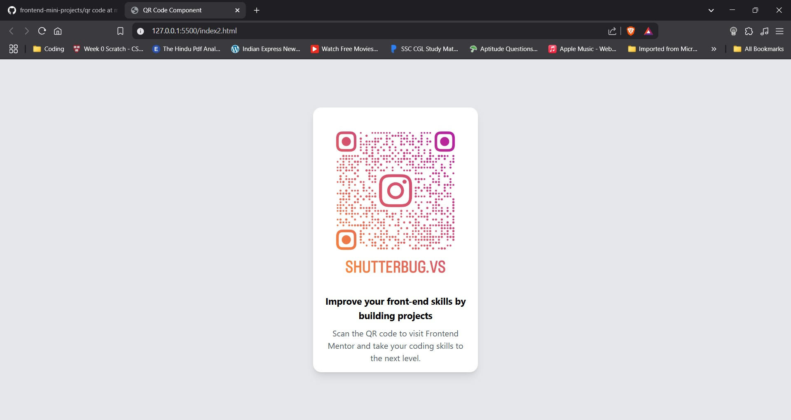

# Frontend Mentor - QR Code Component Solution

This is a solution to the [QR Code Component Challenge on Frontend Mentor](https://www.frontendmentor.io/challenges/qr-code-component-iux_sIO_H). Frontend Mentor challenges help improve coding skills by building realistic projects.

## 📌 Table of Contents
- [Overview](#overview)
  - [Screenshot](#screenshot)
  - [Links](#links)
- [My Process](#my-process)
  - [Built With](#built-with)
  - [What I Learned](#what-i-learned)
  - [Continued Development](#continued-development)
  - [Useful Resources](#useful-resources)
- [Author](#author)
- [Acknowledgments](#acknowledgments)

---

## 📌 Overview

### 📸 Screenshot



### 🔗 Links
- **Solution URL:** [Add solution URL here](https://your-solution-url.com)
- **Live Site URL:** [Add live site URL here](https://vishal3156.github.io)

---

## 🚀 My Process

### 🛠️ Built With
- Semantic **HTML5** markup
- **Tailwind CSS**
- **Flexbox**
- **Mobile-first workflow**

### 📚 What I Learned
This project helped me practice **mobile-first design** and improve my skills in **Tailwind CSS and responsiveness**. Here are some key things I implemented:

```html
<div class="bg-white p-4 rounded-2xl shadow-lg w-80 text-center">
    
    <h1 class="text-lg font-bold mt-4">Follow Me on Instagram!</h1>
    <p class="text-gray-600 mt-2">Scan the QR code to visit my Instagram profile and stay updated with my latest photos and content. Don't forget to hit follow!</p>
</div>
```

### 🔄 Continued Development
In future projects, I aim to:
- Enhance **animations & transitions**
- Explore **CSS Grid** for better layout control
- Improve **accessibility (WCAG standards)**

### 📌 Useful Resources
- [MDN Web Docs](https://developer.mozilla.org/) - For HTML & CSS reference
- [Tailwind CSS Documentation](https://tailwindcss.com/docs) - Tailwind framework guide
- [Frontend Mentor Community](https://www.frontendmentor.io/) - For inspiration & feedback

---

## 👤 Author
- **Frontend Mentor:** [@vishal3156](https://www.frontendmentor.io/profile/vishal3156)
- **Twitter:** [@shutterbugvs](https://www.twitter.com/shutterbugvs)

---

## 🎉 Acknowledgments
Big thanks to **Frontend Mentor** for providing such great challenges to improve frontend development skills!

---
